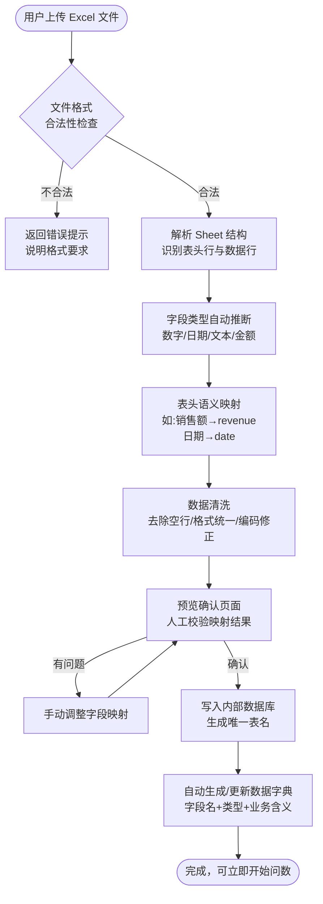
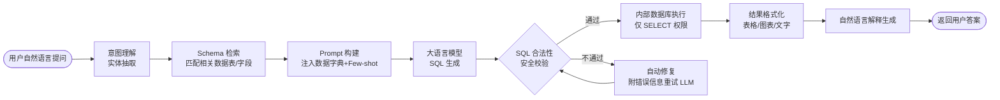
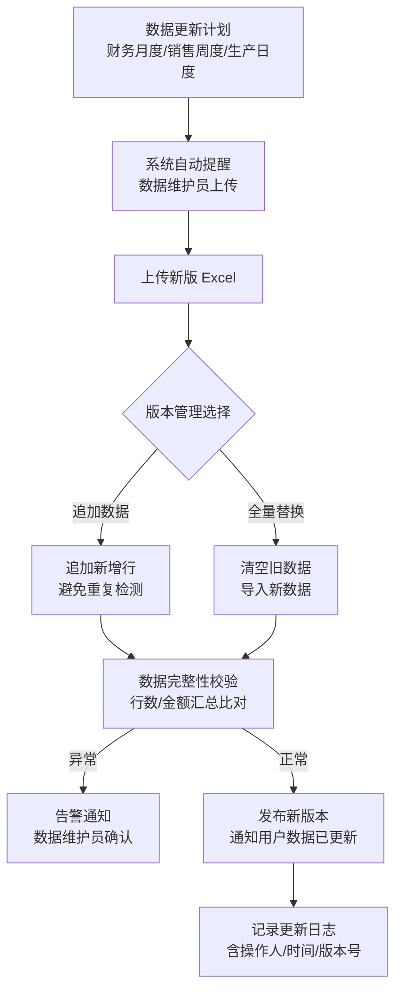
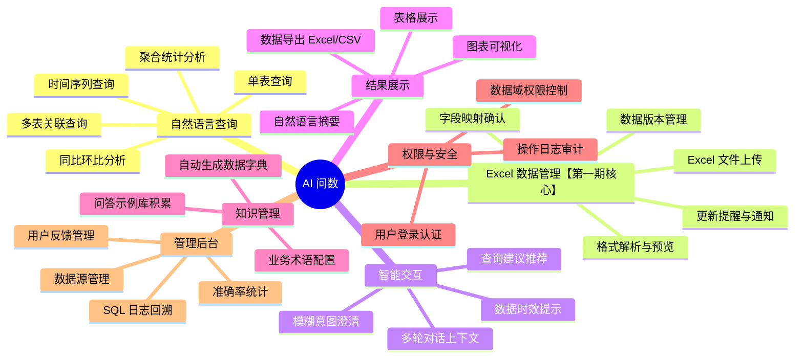
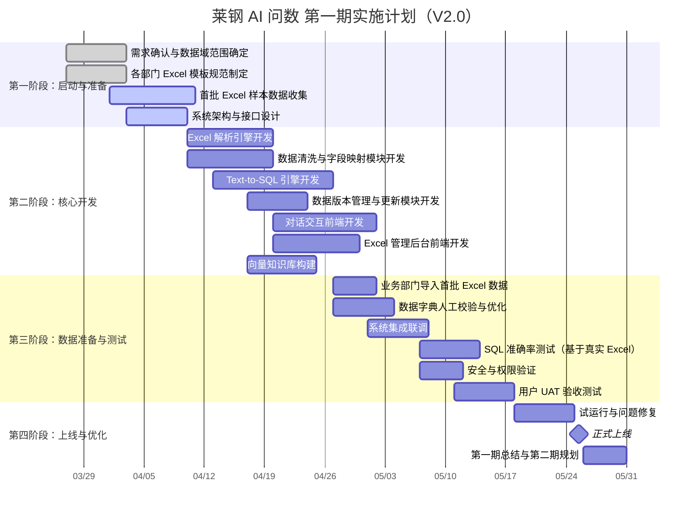
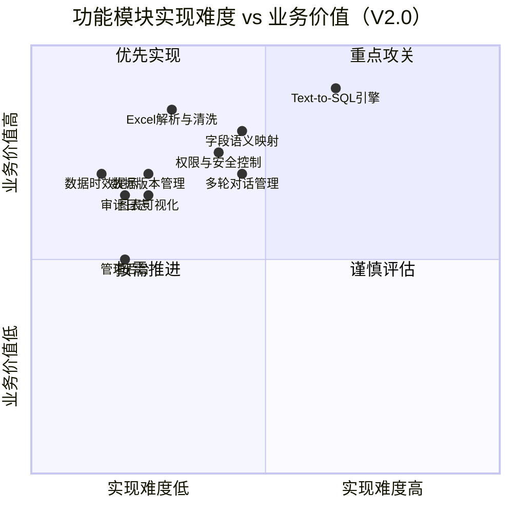
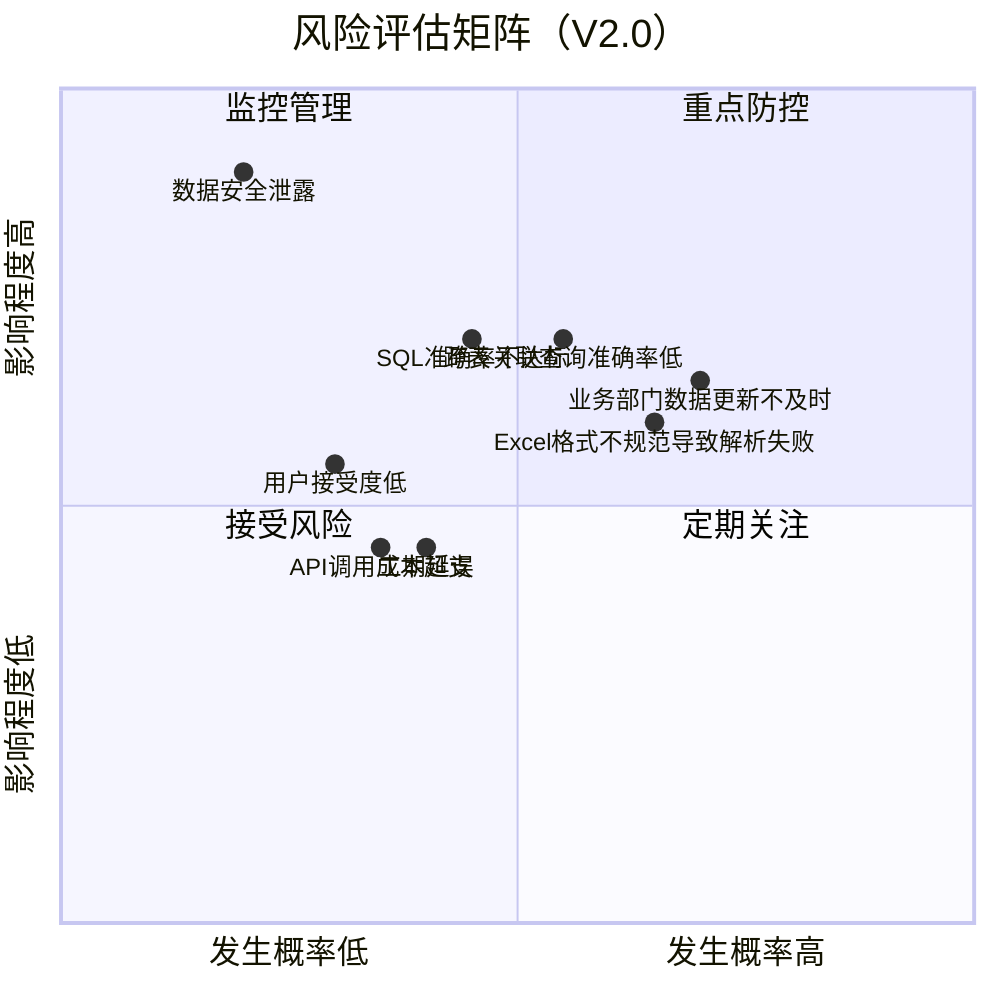
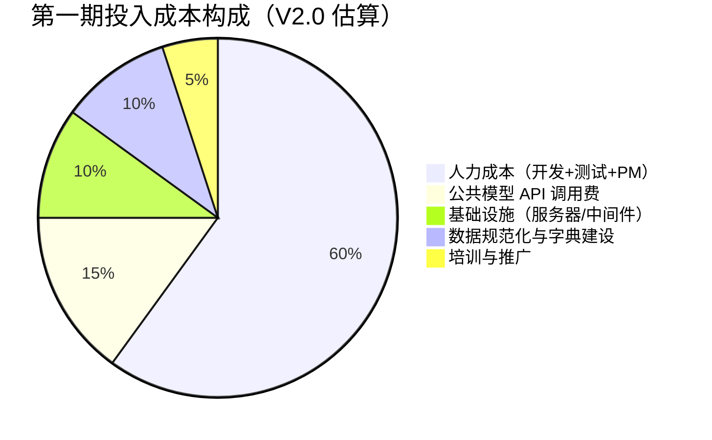
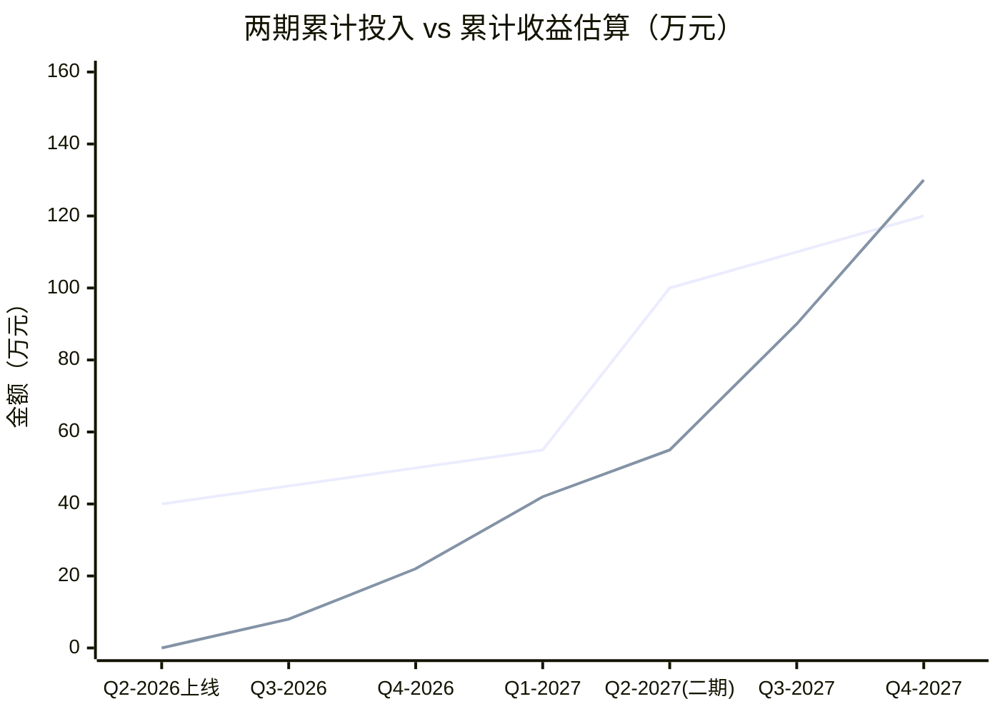
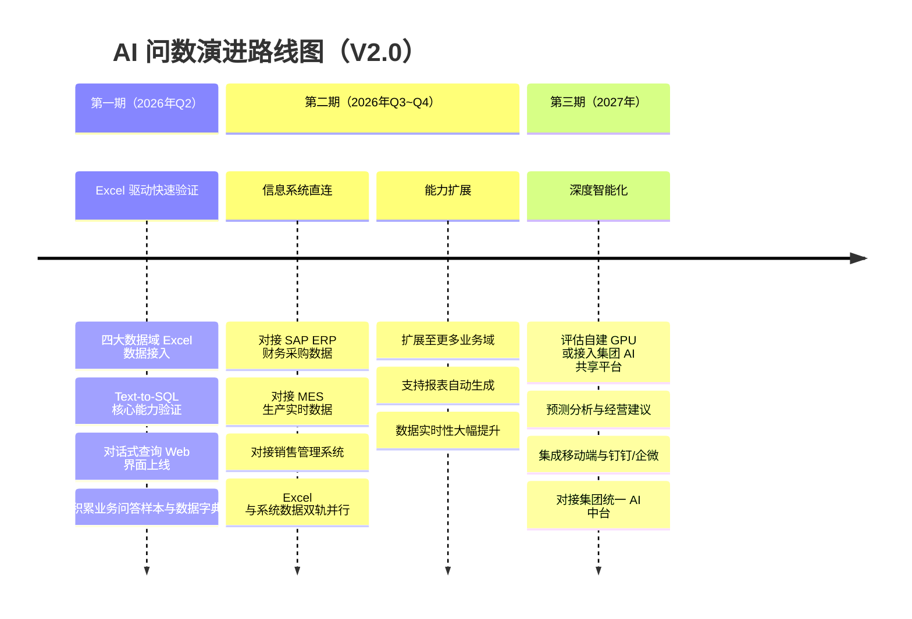

# 莱钢集团 AI 问数解决方案

**文档版本：** V2.0
**编制日期：** 2026年3月
**项目负责人：** （待填写）
**文档状态：** 正式版
**版本说明：** 相较 V1.0，第一期数据接入方式调整为 **Excel 文件导入**，后期再逐步对接现有信息系统；据此同步修订技术架构、功能设计、实施计划、难度评定、风险评估及投资估算。

---

## 目录

1. 项目背景
2. 分期建设策略
3. 目标与范围
4. 技术架构
5. Excel 数据接入设计
6. 主要功能
7. 实施计划（工期排定）
8. 实现难度评定
9. 风险评估
10. 投资收益分析
11. 后续演进路线
12. 附录

---

## 一、项目背景

### 1.1 企业现状

莱钢集团作为大型钢铁联合企业，长期积累了大量财务数据、生产数据、供应链数据及业务运营数据。现阶段，数据查询与分析工作主要依赖以下方式：

- **人工查询**：业务人员手动登录 ERP、MES、BI 等系统逐一检索，效率低下；
- **IT 工单依赖**：复杂统计分析需提交 IT 部门开发报表，周期通常为 3~10 个工作日；
- **BI 看板局限**：预置报表无法灵活应对临时性、个性化的数据需求；
- **数据孤岛**：各业务系统数据分散，跨系统分析门槛高，需具备较强 SQL 能力；
- **Excel 依赖普遍**：各业务部门已长期习惯将关键数据导出为 Excel 进行整理，存在大量可直接利用的 Excel 数据资产。

上述痛点导致业务决策响应速度慢、数据价值利用不充分，难以支撑集团精细化管理与战略决策需求。

### 1.2 项目机遇

近年来，以大语言模型（LLM）为核心的 **Text-to-SQL** 技术趋于成熟，具备将自然语言问题自动转化为结构化查询语句的能力。结合莱钢集团各部门已有 Excel 数据资产，可以**最低的系统集成代价、最快的速度**验证 AI 问数的业务价值，为后续规模化建设奠定基础。

### 1.3 项目定义

> **AI 问数**：基于自然语言处理技术，通过对话交互方式实现对结构化数据的快速查询与分析。**第一期以 Excel 文件为数据源**，快速建立可用系统并验证业务效果；**第二期起逐步对接 ERP、MES 等现有信息系统**，实现全面数据互联，显著提升查询效率、降低分析门槛，助力业务决策与经营研究。

---

## 二、分期建设策略

### 2.1 两期策略总览

```mermaid
flowchart LR
    subgraph 第一期：Excel驱动快速验证
        direction TB
        E1[业务部门导出\nExcel 文件]
        E2[上传至 AI 问数平台]
        E3[自动解析建立\n内部查询数据库]
        E4[自然语言问数\n快速见效]
        E1 --> E2 --> E3 --> E4
    end

    subgraph 第二期：信息系统直连
        direction TB
        S1[SAP ERP]
        S2[MES 制造执行]
        S3[销售管理系统]
        S4[其他业务系统]
        S1 & S2 & S3 & S4 --> DB[(统一数据接入层)]
        DB --> QUERY[扩展查询能力\n实时数据覆盖]
    end

    第一期：Excel驱动快速验证 --"验证可行\n平台成熟"--> 第二期：信息系统直连
```

### 2.2 分期价值对比

| 维度 | 第一期（Excel 导入） | 第二期（系统直连） |
|------|-------------------|-----------------|
| 启动速度 | **极快**，1周内可导入首批数据 | 较慢，需系统对接开发 |
| 集成难度 | **极低**，无需对接任何现有系统 | 较高，需适配 Oracle/SQL Server/MySQL |
| 数据实时性 | 手动更新，准实时 | 实时或定时同步 |
| 数据覆盖 | 各部门已有 Excel 台账 | 全量业务系统数据 |
| 人员配合 | 业务部门整理导出 Excel 即可 | 需 IT 部门深度参与 |
| 投资规模 | **低**，无系统集成成本 | 中，增加接口开发成本 |
| 验证目标 | 验证 AI 问数业务价值与用户接受度 | 规模化推广，全面替代人工查询 |

### 2.3 第一期 Excel 数据来源规划

| 数据域 | Excel 数据来源 | 更新频率 | 负责人 |
|-------|-------------|---------|------|
| 财务数据 | 财务部月度收入成本报表、利润表、资产负债表 | 月度 | 财务部 |
| 销售数据 | 销售部订单台账、回款明细、客户统计 | 周度 | 销售部 |
| 生产数据 | 生产调度日报/月报、产量统计、质量指标汇总 | 日度/周度 | 生产调度 |
| 采购数据 | 采购部采购台账、供应商价格对比、入库记录 | 月度 | 采购部 |

---

## 三、目标与范围

### 3.1 建设目标

| 维度 | 第一期目标 | 第二期目标 |
|------|----------|----------|
| 效率提升 | 数据查询响应从平均 3 天压缩至 30 秒以内 | 支持实时数据查询，响应 ≤ 10 秒 |
| 门槛降低 | 无需 SQL 基础，业务人员通过对话获取数据 | 覆盖全体业务与管理人员 |
| 数据来源 | Excel 文件导入，四大数据域覆盖 | 对接 ERP、MES 等现有系统 |
| SQL 准确率 | ≥ 85%，持续优化至 ≥ 92% | ≥ 92%，并扩展复杂分析能力 |
| 安全合规 | 用户权限管理，操作日志审计 | 行列级数据隔离，与 AD 域集成 |

### 3.2 第一期数据范围

- **财务数据**：收入、成本、利润、应收应付、资金流水等（来源：财务部 Excel）
- **销售数据**：合同、订单、发货、回款、客户等（来源：销售部 Excel 台账）
- **生产数据**：产量、工序、设备、质量指标等（来源：生产调度报表）
- **采购数据**：采购计划、供应商、价格、入库等（来源：采购部 Excel 台账）

---

## 四、技术架构

### 4.1 整体架构图（第一期）

```mermaid
graph TB
    subgraph 用户层
        A1[业务人员 Web端]
        A2[管理人员 PC 端]
        A3[数据维护人员\n上传 Excel]
    end

    subgraph 数据接入层【第一期核心新增】
        X1[Excel 文件上传]
        X2[格式解析与校验\n.xlsx / .xls / .csv]
        X3[表头语义识别\n字段自动映射]
        X4[数据清洗与标准化]
        X5[写入内部 SQLite/PostgreSQL]
        X6[自动生成数据字典与 Schema]
        X1 --> X2 --> X3 --> X4 --> X5 --> X6
    end

    subgraph 交互层
        B1[对话管理模块]
        B2[意图识别与澄清]
        B3[多轮上下文管理]
    end

    subgraph 核心引擎层
        C1[Text-to-SQL 引擎]
        C2[Schema 感知与元数据管理]
        C3[SQL 校验与安全过滤]
        C4[结果解释与自然语言生成]
    end

    subgraph 知识层
        D1[数据字典 / 业务词库]
        D2[历史问答库 Q&A Cache]
        D3[表结构元数据 Metadata]
    end

    subgraph 模型层
        E1[公共大语言模型 API\n通义千问 / 文心一言]
        E2[Embedding 模型\n语义向量检索]
    end

    subgraph 数据存储层
        F1[Excel 原始文件存储]
        F2[解析后结构化数据库\nSQLite → PostgreSQL]
        F3[版本历史管理]
    end

    subgraph 运维层
        G1[日志审计]
        G2[权限管理]
        G3[数据更新提醒]
    end

    A3 --> X1
    X6 --> D3
    A1 & A2 --> B1
    B1 --> B2 --> B3 --> C1
    C1 --> C2 --> D3
    C1 --> D1 & D2
    C1 --> E1
    C2 --> E2
    C1 --> C3 --> F2
    C3 --> C4 --> E1
    C4 --> B1
    F1 & F2 & F3 -.-> 数据存储层
    G1 & G2 & G3 -.->|监控全链路| C1
```

### 4.2 Excel 数据接入核心流程



### 4.3 查询核心流程



### 4.4 第一期技术选型

| 组件 | 选型方案 | 说明 |
|------|---------|------|
| 大语言模型 | 通义千问 API / 文心 API | 国内合规，按 Token 计费，无需 GPU |
| Embedding | text-embedding-v3 | 语义检索，向量化数据字典 |
| 向量数据库 | ChromaDB | 轻量，适合第一期规模 |
| **Excel 解析** | **pandas + openpyxl** | 支持 .xlsx/.xls/.csv，功能完善 |
| **内部数据库** | **SQLite（开发）→ PostgreSQL（生产）** | Excel 数据落库后统一用 SQL 查询 |
| 后端框架 | Python FastAPI | 轻量、异步、易部署 |
| 前端框架 | Vue3 + Element Plus | 对话式 UI + 文件上传管理界面 |
| 部署环境 | 企业内网 Docker 容器 | LLM 调用走 API，本地无需 GPU |

---

## 五、Excel 数据接入设计

### 5.1 支持的文件规范

| 规范项 | 要求 |
|-------|------|
| 文件格式 | .xlsx、.xls、.csv（UTF-8 编码） |
| 单文件大小 | ≤ 50 MB（约 50 万行） |
| 表头要求 | 第一行为表头，表头名称应具备业务含义 |
| 数据起始行 | 默认第二行，可配置 |
| 单次上传 | 支持批量上传，每批最多 10 个文件 |
| 合并单元格 | 自动展开，不支持复杂嵌套表头（需人工整理为标准表格） |

### 5.2 Excel 模板规范（推荐各业务部门参照）

为提高自动识别准确率，建议各业务部门导出 Excel 时遵循以下规范：

```
✅ 标准格式示例（财务收入月报）：

| 月份       | 产品线    | 产品名称  | 销售收入（万元） | 销售量（吨） | 单价（元/吨） |
|-----------|---------|---------|-------------|----------|------------|
| 2026-01   | 板材     | 热轧卷板  | 1250.50     | 8500     | 1471.18    |
| 2026-01   | 型钢     | H型钢    | 860.00      | 6200     | 1387.10    |

❌ 需避免的格式：
- 合并单元格做多级表头
- 表头行包含空列或空行
- 数字字段含文字单位（如"1250万元"）
- 日期格式不统一（有的"2026/1"，有的"2026年1月"）
```

### 5.3 数据更新管理流程



### 5.4 数据时效性说明与提示策略

由于第一期采用手动上传模式，系统需在查询结果中明确标注数据时效：

> **示例提示：** "本次查询结果基于【2026年3月销售台账.xlsx】，数据截至 2026-03-15，由销售部于 2026-03-18 上传。如需最新数据，请联系销售部数据维护员更新。"

---

## 六、主要功能

### 6.1 功能清单



### 6.2 典型使用场景

**场景一：财务快查（Excel 数据源）**

> 用户提问："查一下今年1月份到3月份的钢材销售收入，和去年同期对比增长了多少？"

系统从已上传的财务月报 Excel 数据中查询，自动生成对比数据及同比增长率，并附带折线图，同时标注数据来源文件和截止日期。

**场景二：生产日报分析（Excel 数据源）**

> 用户提问："上周高炉一号的日均产量是多少，有没有低于计划指标的天次？"

系统从生产调度上传的日报 Excel 中关联产量与计划指标，返回明细及偏差分析。

**场景三：采购价格比较（Excel 数据源）**

> 用户提问："近三个月焦炭采购均价是多少，主要供应商各占多少比例？"

系统从采购台账 Excel 聚合分析，生成供应商占比饼图与价格趋势图。

**场景四：数据跨表关联（Excel 数据源）**

> 用户提问："把本月各产品的销售收入和上月的生产成本对比一下，哪些产品毛利率最高？"

系统自动跨销售 Excel 与生产成本 Excel 进行关联计算，返回毛利率排名表。

---

## 七、实施计划（工期排定）

目标：**2026年5月底完成第一期上线**

> V2.0 调整说明：取消原数据库连接适配开发工作，新增 Excel 解析引擎与数据管理模块开发，整体工期不变，但交付物结构调整。



### 7.1 各阶段交付物

| 阶段 | 时间 | 交付物 |
|------|------|-------|
| 启动与准备 | 3月底~4月上旬 | Excel 数据规范模板、样本数据集、架构设计文档 |
| 核心开发 | 4月上旬~4月底 | 可运行 Demo（含 Excel 上传+问数全流程）、API 接口文档 |
| 数据准备与测试 | 4月底~5月中旬 | 首批真实业务 Excel 入库、测试报告、UAT 签收单 |
| 上线运营 | 5月下旬 | 系统上线、Excel 上传操作手册、运维文档 |

### 7.2 关键里程碑

| 里程碑 | 目标日期 | 验收标准 |
|-------|---------|---------|
| M1：首批数据可查 | 2026-04-20 | 至少 1 个数据域的 Excel 可上传并完成自然语言查询 |
| M2：四域数据全覆盖 | 2026-05-07 | 四大数据域 Excel 全部入库，基础查询通过率 ≥ 85% |
| M3：UAT 通过 | 2026-05-18 | 业务用户验收签字，核心场景通过率 ≥ 90% |
| M4：正式上线 | 2026-05-25 | 系统稳定运行，用户手册完备 |

---

## 八、实现难度评定

### 8.1 难度矩阵



### 8.2 关键难点分析

**难点一：非标 Excel 自动解析（难度：★★★☆☆）**

莱钢各业务部门历史 Excel 格式各异，存在合并单元格、多级表头、不规范日期格式、数字混文字单位等问题。需设计鲁棒的解析引擎，并提供人工校验界面作为兜底。

> **应对策略：** 第一期同步推出《Excel 数据提报规范》，要求各部门按模板整理数据；同时开发智能纠错提示，引导用户修正格式问题。

**难点二：表头语义自动映射（难度：★★★☆☆）**

业务 Excel 的表头千变万化（"销售额（万元）"、"本月营收"、"revenue"均表示收入），需借助 Embedding 语义模型将其映射为标准字段，才能保证 Text-to-SQL 准确率。

> **应对策略：** 构建钢铁行业业务词汇映射表，结合 LLM 辅助识别，首次上传需人工确认映射关系，系统学习后自动化程度持续提升。

**难点三：跨 Excel 关联查询（难度：★★★★☆）**

用户往往需要跨多个 Excel（如"销售台账"和"生产成本"）进行关联分析。需设计清晰的关联键管理机制（如产品编码、月份维度），否则 LLM 生成的 JOIN SQL 会出现大量错误。

> **应对策略：** 要求上传时配置关联键；在数据字典中明确标注各表的主键和可关联字段；积累跨表查询的 Few-shot 示例。

**难点四：数据时效管理（难度：★★☆☆☆）**

手动上传模式下，用户可能查询到过期数据而不知情，影响决策质量。

> **应对策略：** 在每条查询结果中强制标注数据截止日期和上传时间；设置数据超期预警（超过配置天数未更新时提醒维护员）。

**难点五：Text-to-SQL 准确率（难度：★★★★☆）**

与 V1.0 相同，SQL 生成准确率是核心难点。基于 Excel 数据源的优势在于字段语义经过人工确认，数据字典质量更高，有助于提升准确率。

---

## 九、风险评估

### 9.1 风险矩阵



### 9.2 风险应对措施

| 风险编号 | 风险描述 | 风险等级 | 应对措施 |
|---------|---------|---------|---------|
| R01 | 数据安全与隐私泄露 | 高 | 全程内网部署；调用 LLM API 仅发送脱敏 Schema，不含业务数据值；操作全程审计 |
| R02 | Excel 格式不规范，解析失败率高 | 中高 | 制定并推广 Excel 数据规范；开发智能错误提示；提供人工映射界面作为兜底 |
| R03 | 业务部门数据更新不及时，数据过期 | 中高 | 建立数据更新 SLA 制度；系统自动发邮件/消息提醒；查询时强制展示数据时效标注 |
| R04 | 跨 Excel 关联查询准确率低 | 中高 | 设计关联键配置机制；积累跨表 Few-shot；第一期优先保障单表查询质量 |
| R05 | SQL 生成准确率不达标 | 中 | 高质量数据字典先行；积累业务 Few-shot 示例；建立用户反馈闭环快速迭代 |
| R06 | 用户接受度低 | 中 | 早期引入种子用户；优先打磨财务/销售高频查询场景；快速见效增强信心 |
| R07 | API 调用成本超支 | 低中 | 设置 Token 日均预算上限；高频查询结果缓存；监控费用日报 |
| R08 | 工期延误 | 中 | Excel 解析相比数据库直连大幅降低集成难度；预留缓冲期；核心功能优先交付 |

> **V2.0 风险变化说明：** 原 V1.0 中"跨系统数据源适配"风险（需对接 Oracle/MySQL/SQL Server）已消除；新增"Excel 格式不规范"和"数据更新不及时"两类风险，但整体风险等级有所下降，工期延误概率降低。

---

## 十、投资收益分析

### 10.1 成本估算（第一期）



| 成本项目 | V1.0 估算（万元）| V2.0 估算（万元）| 变化说明 |
|---------|--------------|--------------|--------|
| 研发人力（4人×3个月）| 30~45 | 25~38 | 取消数据库适配开发，新增 Excel 解析模块，整体工作量下降约 15% |
| 公共模型 API（月均）| 0.5~2 | 0.5~2 | 不变 |
| 服务器及中间件 | 3~5 | 2~4 | Excel 模式无需数据库连接池等中间件，成本略降 |
| 数据治理配合成本 | 5~8 | 3~5 | 业务部门只需整理 Excel，工作量比提供数据库权限低 |
| **合计（一次性投入）** | **38~60** | **30~49** | **节省约 10~15 万元** |

> **V2.0 成本优化说明：** 采用 Excel 导入方式规避了系统集成的复杂度，开发工作量减少约 15%，业务部门配合成本也显著降低，整体第一期投入可压缩至 **30~49 万元**。

### 10.2 收益估算

| 收益项目 | 量化估算 | 说明 |
|---------|---------|------|
| 数据查询效率提升 | 节省人力 ≈ 1.5~2.5 人/年 | 第一期基于 Excel 数据，覆盖部分日常查询需求 |
| IT 报表需求减少 | 降低 IT 工单 20%~35% | Excel 数据域的报表请求明显减少 |
| 决策响应速度 | 分析周期从天级降至分钟级 | 尤其对财务、销售月度数据分析效果显著 |
| 第二期基础价值 | 平台架构验证、用户习惯培养 | 为系统直连阶段大规模推广奠定基础 |

### 10.3 投资回收分析



> 第一期（Excel 模式）预计 **10~14 个月**回收投资，较 V1.0 略快（启动更快、成本更低）。第二期系统直连上线后，覆盖范围大幅扩展，收益加速增长。

---

## 十一、后续演进路线



### 11.1 第一期到第二期的过渡策略

第二期启动系统直连时，Excel 导入能力**不会废弃**，而是作为补充渠道保留：

| 数据类型 | 第二期数据来源策略 |
|---------|----------------|
| ERP 财务数据 | 切换为 SAP 直连实时获取；Excel 上传作为历史数据补充 |
| MES 生产数据 | 切换为 MES 直连；Excel 上传用于计划指标等人工维护数据 |
| 销售订单数据 | 切换为销售系统直连；Excel 上传用于客户分类等补充维护 |
| 临时性分析数据 | 持续保留 Excel 上传能力，满足一次性分析需求 |

### 11.2 算力建设决策条件

| 触发条件 | 推荐方案 |
|---------|---------|
| 月均 API 费用 < 5 万元 | 继续使用公共模型 API |
| 月均 API 费用 5~15 万元 | 评估接入集团 AI 共享平台 |
| 月均 API 费用 > 15 万元 或 数据安全要求提升 | 启动自建 GPU 平台（A100/H100）|
| 集团统一 AI 平台建设成熟 | 优先接入集团共享资源，降低重复建设 |

---

## 十二、附录

### A. 关键术语

| 术语 | 解释 |
|------|------|
| Text-to-SQL | 将自然语言问题自动转换为 SQL 查询语句的技术 |
| LLM | 大语言模型，如通义千问、文心一言等 |
| Embedding | 将文本转化为向量表示，用于语义相似度检索 |
| RBAC | 基于角色的访问控制，用于数据权限管理 |
| Few-shot | 通过少量示例引导 LLM 理解特定任务的技术 |
| Schema | 数据表的结构描述，包括表名、字段名、字段类型等 |
| 数据字典 | 对数据表和字段的业务含义进行说明的知识库 |

### B. Excel 数据规范要求（发送各业务部门）

**强制要求：**
1. 第一行必须是表头，不得有空列或合并单元格表头
2. 数字字段必须是纯数字，不含"万元"、"吨"等单位文字（单位在表头注明）
3. 日期字段统一使用 `YYYY-MM-DD` 或 `YYYY-MM` 格式
4. 不得有完全空白的行夹在数据中间
5. 文件命名格式：`[部门]_[数据类型]_[数据截止日期].xlsx`，如：`财务部_月度收入_202603.xlsx`

**建议：**
- 每个 Sheet 只包含一类数据，不要在同一 Sheet 混合多种报表
- 保留原始数据，不要在 Excel 中使用公式计算结果覆盖原始值

### C. 第二期信息系统接入清单（规划）

| 系统名称 | 数据库类型 | 核心数据域 | 计划接入时间 |
|---------|----------|----------|-----------|
| SAP ERP | Oracle | 财务、采购 | 2026年Q3 |
| MES 制造执行 | SQL Server | 生产 | 2026年Q3 |
| 销售管理系统 | MySQL | 销售 | 2026年Q4 |
| 人力资源系统 | Oracle | 人员 | 2027年（第三期）|

### D. 团队组建建议

| 角色 | 人数 | 职责 |
|------|------|------|
| 项目经理 | 1 | 总体协调、进度管控、各部门沟通 |
| 后端开发 | 2 | Excel 解析引擎、Text-to-SQL 引擎、API 服务 |
| 前端开发 | 1 | 对话界面、Excel 管理界面、可视化 |
| 算法工程师 | 1 | Prompt 工程、准确率优化、语义映射 |
| 测试工程师 | 1 | 功能测试、SQL 准确率验收 |
| 业务数据联络员（兼职）| 4 | 各业务域各1名，负责 Excel 数据整理、数据字典确认、日常更新维护 |

---

**版本变更记录**

| 版本 | 日期 | 变更内容 | 变更人 |
|-----|------|---------|------|
| V1.0 | 2026-03-26 | 初始版本 | — |
| V2.0 | 2026-03-26 | 第一期数据源调整为 Excel 导入；新增第二章分期建设策略；新增第五章 Excel 数据接入设计；更新技术架构、甘特图、风险矩阵、成本估算及演进路线 | — |

---

*本文档由莱钢集团信息化项目组编制，如有调整请更新版本并注明变更记录。*
